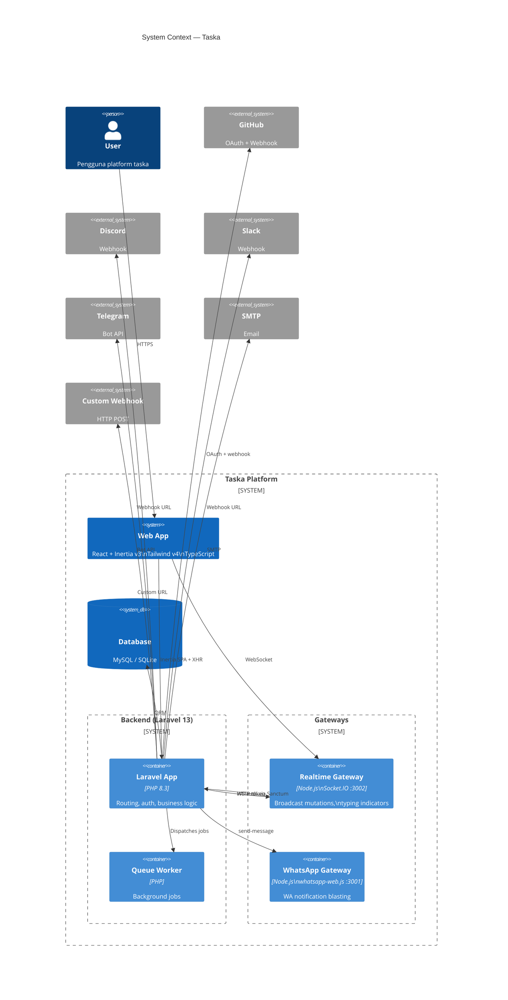
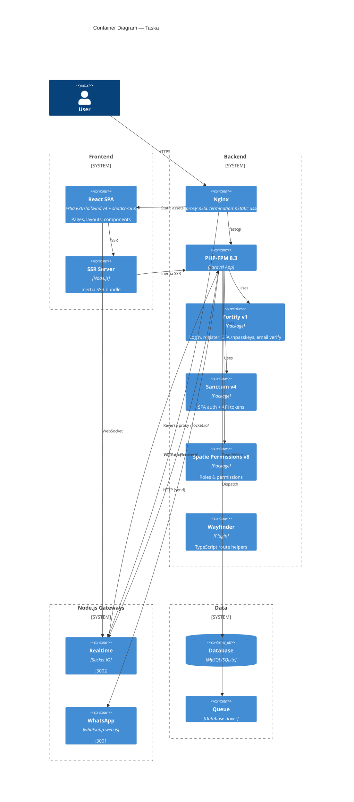
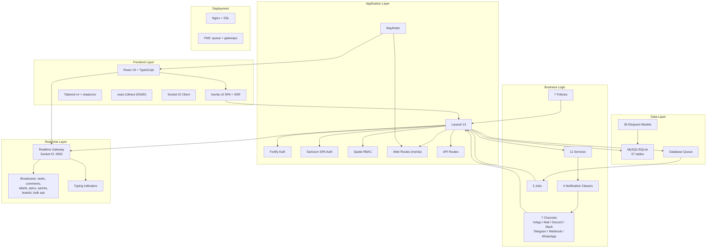
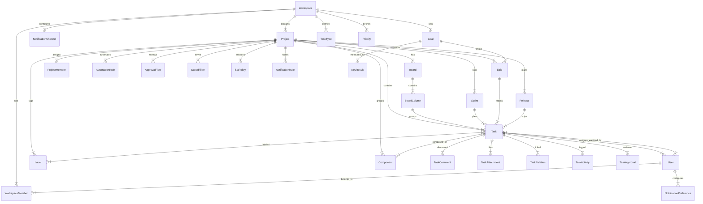
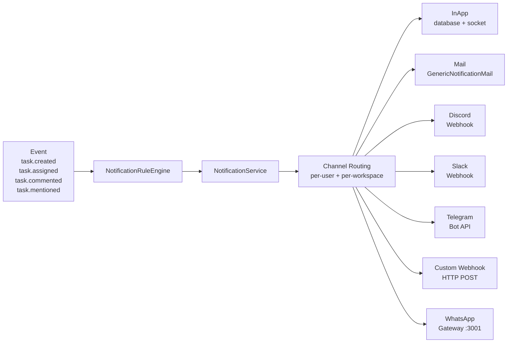
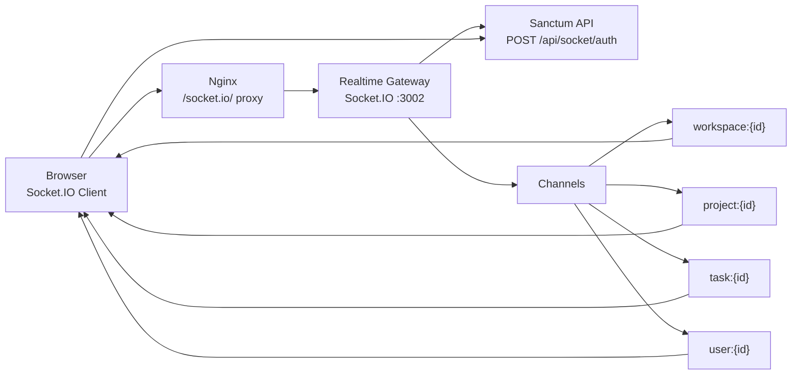
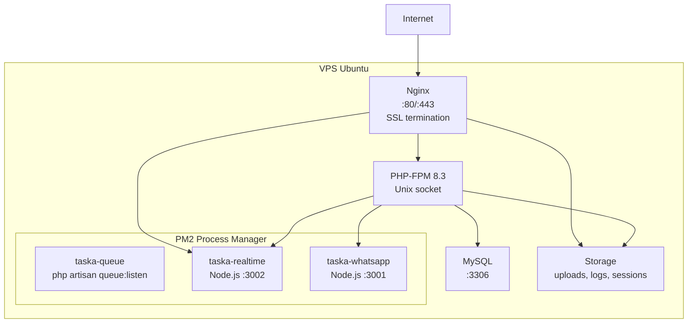

# Taska — Architecture

## System Context (C4 Level 1)



## Container Diagram (C4 Level 2)



## System Layers



## Domain Model (Core Entities)



## Notification Flow



## Real-time Broadcast



## Deployment Architecture



## Directory Structure (Simplified)

```
taska/
├── app/
│   ├── Actions/Fortify/     Auth action classes
│   ├── Http/Controllers/   41 controllers + 3 sub-namespaces
│   ├── Jobs/               3 job classes
│   ├── Mail/               GenericNotificationMail
│   ├── Models/             36 Eloquent models
│   ├── Notifications/      4 notifications + 7 channels
│   ├── Policies/           7 authorization policies
│   ├── Providers/          App + Fortify service providers
│   ├── Queries/            TaskSearchQuery
│   └── Services/           11 service classes
├── config/                 17 config files
├── database/
│   ├── factories/          Model factories
│   ├── migrations/         47 migration files
│   └── seeders/            Database seeders
├── deploy/
│   ├── DEPLOY.md           Deployment guide (ID)
│   ├── ecosystem.config.cjs PM2 process config
│   ├── nginx.conf           Nginx site config
│   ├── supervisor-queue.conf
│   └── .env.production.example
├── docs/
│   ├── architecture.md     This file
│   ├── github-integration.md
│   └── plans/
├── realtime-gateway/       Node.js Socket.IO gateway
├── whatsapp-gateway/       Node.js WhatsApp gateway
├── resources/
│   └── js/
│       ├── components/     71 components + ui/ + board/ + charts/ + dashboard/
│       ├── layouts/        5 layout types
│       ├── pages/          11 page groups (33 pages)
│       ├── hooks/          Socket, theme, etc.
│       ├── i18n/           EN/ID translations
│       └── app.tsx         Inertia app entry
├── routes/
│   ├── web.php             Main Inertia routes
│   ├── api.php             API routes
│   ├── settings.php        Settings routes
│   └── admin.php           Admin routes
└── tests/
    ├── Feature/            33 feature tests
    └── Unit/               2 unit tests
```

## Tech Stack

| Layer | Technology | Version |
|-------|-----------|---------|
| Backend | PHP + Laravel | 8.3 / 13 |
| Auth | Fortify + Sanctum | v1 / v4 |
| RBAC | Spatie Permissions | v8 |
| Frontend | React + Inertia + TypeScript | 19 / v3 / strict |
| CSS | Tailwind CSS via Vite | v4 |
| UI Kit | shadcn/ui (Radix UI) | latest |
| i18n | react-i18next | latest |
| Realtime | Socket.IO (custom Node.js) | Port 3002 |
| WhatsApp | whatsapp-web.js (custom Node.js) | Port 3001 |
| Database | MySQL (production) / SQLite (dev) | |
| Queue | Database driver | |
| Process | PM2 + Nginx + Supervisor | |
| Testing | Pest PHP | v4 |
| Linting | Pint + ESLint + Prettier | |
| Route Gen | Laravel Wayfinder | v0 |
